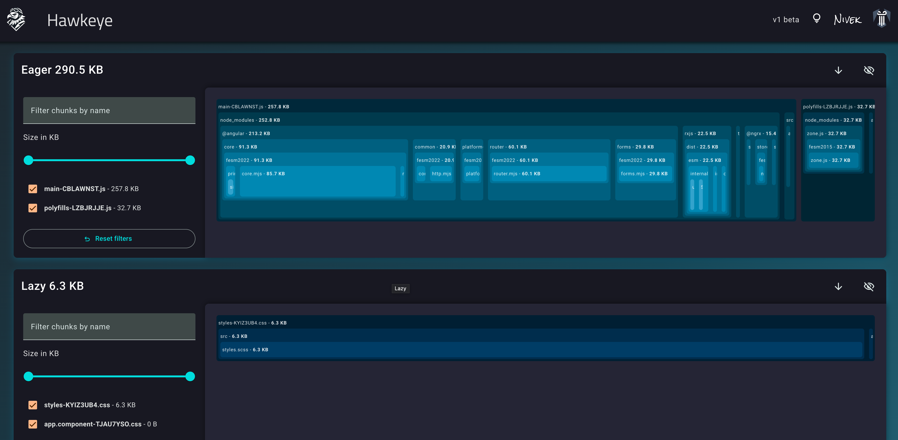

# Hawkeye
<!-- ALL-CONTRIBUTORS-BADGE:START - Do not remove or modify this section -->
[](#contributors-)
<!-- ALL-CONTRIBUTORS-BADGE:END -->

<!--
<div style="display: flex; justify-content: center">

</div>
-->



<!-- START doctoc generated TOC please keep comment here to allow auto update -->
<!-- DON'T EDIT THIS SECTION, INSTEAD RE-RUN doctoc TO UPDATE -->
**Table of Contents**  *generated with [DocToc](https://github.com/thlorenz/doctoc)*

- [Setting up analyze scripts](#setting-up-analyze-scripts)
- [Running the analyzer directly](#running-the-analyzer-directly)
- [Version](#version)
- [Help](#help)
- [Contributors ✨](#contributors-)

<!-- END doctoc generated TOC please keep comment here to allow auto update -->


Welcome to Hawkeye, a powerful tool designed to help developers visualize and optimize their JavaScript bundles. With
our intuitive interface, you can gain deep insights into your project’s bundle structure, identifying large modules,
dependencies, and assets that may be impacting performance.

Our visual breakdown allows you to see exactly how your code and third-party libraries contribute to the overall size of
your bundle, empowering you to make data-driven decisions to improve load times, enhance performance, and streamline
your build process.

## Setting up analyze scripts

Hawkeye is provides a `init` command to help you set up analyze scripts in your `package.json` with ease.
Simply run the following command and answer the questions from the wizard:

```bash
npx @angular-experts/hawkeye init
```

## Analyze Your Bundle with Hawkeye

From here on you can run the following commands to analyze your project:
```bash
npm run analyze
```

How it works:

1. Generating build stats: It builds the project and creates a stats.json file containing information about the bundled output. You'll find this file in your project's output directory (usually ./dist).
2. Launching an analysis server: A server starts at http://localhost:1420. 

Open it in your browser and upload the stats.json file to see a visual representation of your bundle's contents.

## Running the analyzer directly

If you already have a stats.json and like to run the analyzer directly on it, you can do so by running the following command:
```bash
npx @angular-experts/hawkeye <pathToStatsJsonFile>
```

## Version
Use the following command to print the version of Hawkeye:
```bash
npx hawkeye --version
```

## Help
For more information on using Hawkeye, including detailed command references run:
```bash
npx hawkeye --help
```

## Contributors ✨

Thanks goes to these wonderful people ([emoji key](https://allcontributors.org/docs/en/emoji-key)):
<!-- ALL-CONTRIBUTORS-LIST:START - Do not remove or modify this section -->
<!-- prettier-ignore-start -->
<!-- markdownlint-disable -->
<table>
  <tbody>
    <tr>
      <td align="center" valign="top" width="14.28%"><a href="https://medium.com/@nivek"><br /><sub><b>Nivek</b></sub></a><br /><a href="https://github.com/Nivek/Hawkeye/commits?author=nivekcode" title="Code">💻</a></td>
    </tr>
  </tbody>
  <tfoot>
    <tr>
      <td align="center" size="13px" colspan="7">
        
          <a href="https://all-contributors.js.org/docs/en/bot/usage">Add your contributions</a>
        </img>
      </td>
    </tr>
  </tfoot>
</table>

<!-- markdownlint-restore -->
<!-- prettier-ignore-end -->
